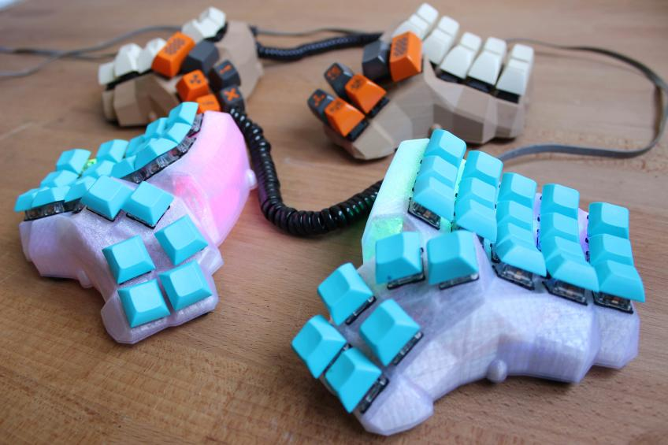
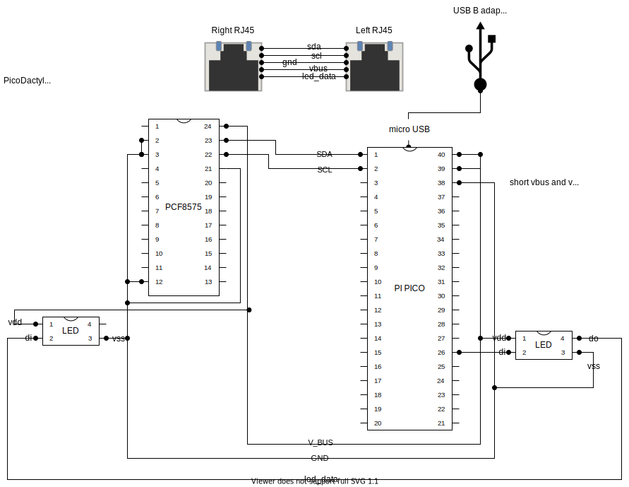
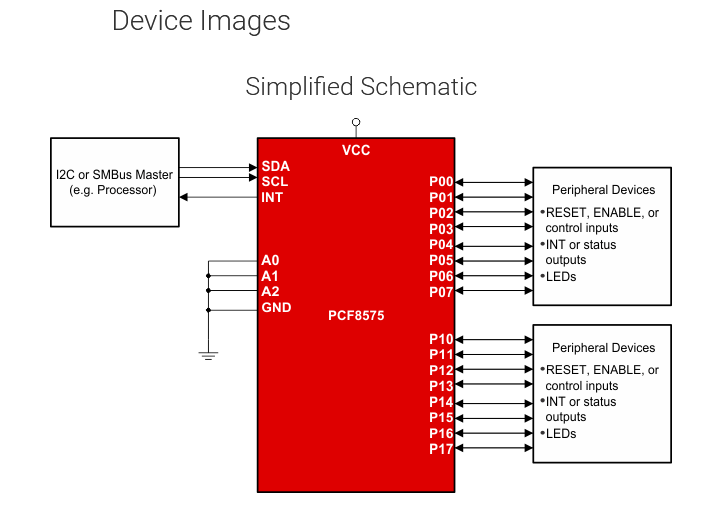

# PicoDactyl

**THIS IS A WORK IN PROGRESS**

inspiration:

## hardware

The following are links to purchase hardware at [microrobotics.org.za](https://microrobotics.org.za).
If you are not located in South Africa you should use your own local electronics store.

- [rpi pico](https://www.robotics.org.za/PI-PICO)
  - [datasheet](https://datasheets.raspberrypi.com/pico/pico-datasheet.pdf)
- [pcf8575](https://www.robotics.org.za/PCF8575-MOD)
  - [python library](https://pypi.org/project/pcf8575/)
  - [datasheet](https://www.ti.com/product/PCF8575)
  - [check this example firmware](https://github.com/KMKfw/kmk_firmware/blob/74fa1fb52e41b95c1df9047e1ffff39001bb67e6/user_keymaps/dzervas/lab68.py) which uses a different i2c expander chip
    - [mcp23017 io expander](https://www.robotics.org.za/MCP23017-DIPo) (out of stock at time of planning)
      - [datasheet](https://ww1.microchip.com/downloads/en/devicedoc/20001952c.pdf)
      - [example circuit](https://www.best-microcontroller-projects.com/mcp23017.html)
      - [another example schematic](https://cdn-learn.adafruit.com/assets/assets/000/036/490/original/lcds___displays_schem.png?1476373463)
- [rj 45 connectors](https://www.robotics.org.za/RJ45-CON-PCB)
  - provides up to eight wires
- [usb B printer cable](https://www.robotics.org.za/PAN-USBB-MUSB)
- [EC11 rotary encoder](https://www.robotics.org.za/EC11-VER-20)
- [M3 brass heat set inserts](https://www.robotics.org.za/SUL-M3-20)
- cherry mx brown switches (salvaged from another keyboard)

## design

- minidox/corne/reviung inspired design
  - 3x6 for main clusters
  - 3/4 keys per hand for thumb cluster
    - can therefore use 2 3x7 matrices and use the rj45 connector for scl/sda/vbus/gnd/v+
  - rotary encoder on one half
  - rgb leds (ws2812 rings from banggood)
    - need 1 data pin (din), power and ground (**check pico datasheet for whether to use vbus or vdd!**)
  - printed in transparent (translucent) PLA
    - print time is estimated 18 hours per side (excluding bottom plate)
  - will need to design inserts for the rj45 connectors and for the usb B adaptor as well as the pi pico holder
    - loligag sled format
      - [example](https://www.printables.com/model/152130-dactyl-maniform-pro-micro-v2-type-c-sled)
    - [wally plate gen](https://www.thingiverse.com/thing:47956/files)
  - will also need to design holder for led rings (probably on the base plate)
  - holder for the pi pico and the io expander
    - [this on from printables.com](https://www.printables.com/model/106736-raspberry-pi-pico-spacer-standoff)
  - use [this converter](https://www.thingiverse.com/thing:3770166) to mount an ec11 encoder in an mx socket.

I used [this dactyl case generator](https://github.com/joshreve/dactyl-keyboard) that uses open cascade and generates much neater models (cleaner stls).

- see ``run_config.json`` for my config used to generate the case
- installation was fairly simple:
  1. install docker desktop
  2. download the dactyl case generator repo
  3. run the ``build_docker.bat`` script.
  4. in docker desktop open the DM-shell container in terminal and run ``bash``
  5. run ``generate_configuration.py``
  6. edit ``src/run_config.json`` (don't forget to save)
  7. run ``python3 dactyl_manuform.py``
  8. open ``things/DM_left.scad`` and preview it in openSCAD
  9. repeat steps 6-8 until happy with the case.
  10. compile the case files in openSCAD and export the stls

my tweaks were:

- 3x6 design with 3 keys on each thumb cluster
- remove oled clips (use ``null``)
- make screw posts larger to fit my inserts
- import into tinkercad to make holes for the connectors and attach mounts for the controller boards
- cleanup mesh in blender (some of the screw posts were sticking through the outside of the case).

### **edit**: Custom case?

I am currently working on a custom dactylesqu case inspired by the skeletyl. I want to try to close all the gaps without making it look spikey.
Doing it from scratch will also make the connectors a bit more polished than my attempts at hacking together stls in tinkercad.
I am using onShape for the time being and it is my first time actually using a real cad package so this might take a while.

## construction

- do columns/rows and diodes first
- attach connectors and micros
- measure out the length of wire to connect rows and columns
- connect rows/cols to the micros and connectors
- hotglue any switches/components that are not fitting tightly

circuit diagram:

## references

