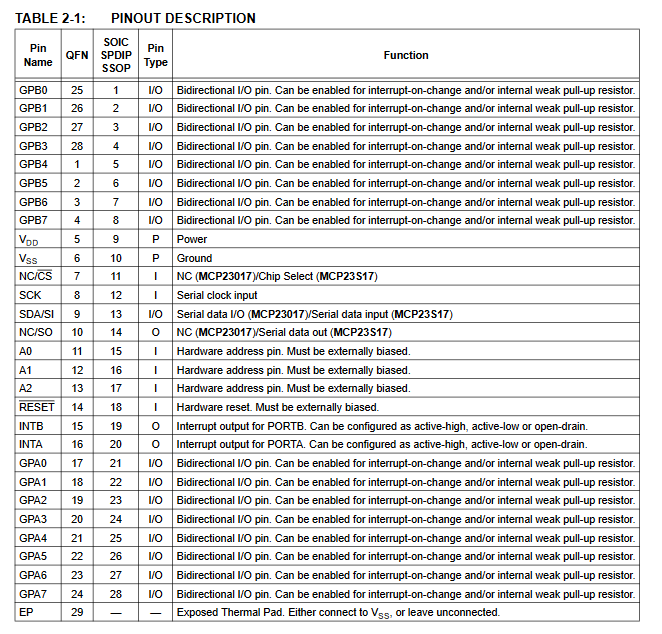

# dactyl

inspiration:

## hardware

- [rpi pico](https://www.robotics.org.za/PI-PICO)
  - [datasheet](https://datasheets.raspberrypi.com/pico/pico-datasheet.pdf)
- [pcf8575](https://www.robotics.org.za/PCF8575-MOD)
  - [python library](https://pypi.org/project/pcf8575/)
  - [datasheet](https://www.ti.com/product/PCF8575)
  - [check this example firmware](https://github.com/KMKfw/kmk_firmware/blob/74fa1fb52e41b95c1df9047e1ffff39001bb67e6/user_keymaps/dzervas/lab68.py) which uses a different i2c expander chip
    - [mcp23017 io expander](https://www.robotics.org.za/MCP23017-DIPo) (out of stock at time of planning)
      - [datasheet](https://ww1.microchip.com/downloads/en/devicedoc/20001952c.pdf)
      - [example circuit](https://www.best-microcontroller-projects.com/mcp23017.html)
      - [another example schematic](https://cdn-learn.adafruit.com/assets/assets/000/036/490/original/lcds___displays_schem.png?1476373463)
- [rj 45 connectors](https://www.robotics.org.za/RJ45-CON-PCB)
  - provides eight wires
- [usb B printer cable](https://www.robotics.org.za/PAN-USBB-MUSB)
- [EC11 rotary encoder](https://www.robotics.org.za/EC11-VER-20)
- [M3 brass heat set inserts](https://www.robotics.org.za/SUL-M3-20)
- cherry mx brown switches (salvaged from another keyboard)

## design

- used [this dactyl case generator](https://dactyl.siskam.link/manuform) to generate the OpenSCAD scripts.
  - see ``manuform-minidox-vx.x.json``

- minidox/corne design
  - 3x6 for main clusters
  - 3/4 keys per hand for thumb cluster
    - can therefore use 2 3x7 matrices and use the rj45 connector for scl/sda/vbus/gnd/v+
  - rotary encoder on one half
  - rgb leds (ws2812 rings from banggood)
    - need 1 data pin (din), power and ground (**check pico datasheet for whether to use vbus or vdd!**)
  - printed in transparent (translucent) PLA
    - print time is estimated 18 hours per side (excluding bottom plate)
  - will need to design inserts for the rj45 connectors and for the usb B adaptor as well as the pi pico holder
  - will also need to design holder for led rings (probably on the base plate)

## construction

- do columns/rows and diodes first
- attach connectors and micros
- measure out the length of wire to connect rows and columns
- connect rows/cols to the micros and connectors
- hotglue any switches/components that are not fitting tightly

circuit diagram:

## references

